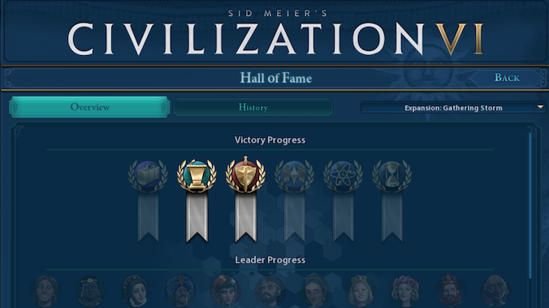

# civ6-hof-merge
## About



Sid Meier's Civilization VI Hall of Fame is not synchronized with Steam or 2K:
It is only saved as a local SQLite database file.

This is problematic for people that play on mulitple platforms, ie. OSX & Windows.

This program `civ6-hof-merge` allows to merge two Hall-of-Fame files into one.

### ⚠️  WARNING
This program has no affiliation with any official Civ6 resource & is provided 'as is'.

Consider that it will corrupt all your files & make backups before you do anything 😉
### ⚠️  WARNING

## Run

Have two Hall-of-Fame SQLite database files available. 
Run `civ6-hof-merge <source1> <source2> <target>` - for example:
```
civ6-hof-merge "/Users/$USER/Library/Application Support/Sid Meier's Civilization VI/HallofFame.sqlite" \
  "C:\Users\$USER\Documents\My Games\Sid Meier's Civilization VI\HallofFame.sqlite" \
  HallofFame.sqlite
```
Afterwards copy the resulting `HallofFame.sqlite` file back to the proper Civ6 location.

The locations in the example execution above are from OSX & Windows.

## License

MIT
